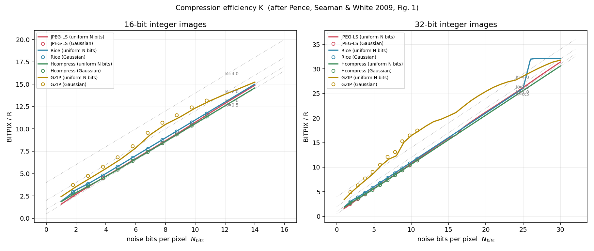

# JPEG-LS compression in CFITSIO — details and benchmarks

Supporting detail for the JPEG-LS section at the top of the [README](../README.md).

---

## 1. How it works

JPEG-LS (ISO/IEC 14495-1) is a lossless / near-lossless image codec built on
*median-edge-detection prediction* plus Golomb–Rice coding of the residuals.
Unlike Rice — which codes each pixel against its immediate neighbour along a
row — JPEG-LS predicts each pixel from three neighbours (left, above, and
above-left), so it exploits two-dimensional structure. That is where its
advantage on real images comes from.

The codec is provided by [CharLS](https://github.com/team-charls/charls),
vendored as a git submodule at `charls/`.

### Sample-format handling

JPEG-LS codes **unsigned** samples of 2–16 bits, but FITS integers are signed,
so each tile is converted before encoding:

| FITS BITPIX | handling |
|---|---|
| 8 | passed through unchanged |
| 16 | `value + 32768` (arithmetic offset, matching FITS BZERO semantics — *not* a bitwise cast) |
| 32 | offset by 2³¹, then split into two 16-bit planes, each coded as its own JPEG-LS stream |

For 32-bit tiles the two streams are packed into one buffer behind a **4-byte
big-endian length** giving the size of the high-plane stream; the low plane
occupies the remainder.

### Near-lossless

`-jN` sets the JPEG-LS `NEAR` parameter, which bounds the absolute error of
every sample by `N`. `NEAR` is recorded inside the codestream, so `funpack`
needs no extra metadata to decode it.

For split 32-bit tiles, `NEAR` is applied to the **low plane only**. An error
of 1 in the high plane would become 65536 in the reconstructed value, which
would break the error bound entirely.

### Threading

**Tiles are compressed strictly sequentially — there is no parallelism.**
`imcomp_compress_image()` loops over tiles one at a time (read tile → compress
→ write table row), and neither CFITSIO nor CharLS spawns threads. This is
true of Rice and Hcompress as well, so the timings below compare
single-threaded throughput throughout. Tile-level parallelism would be
straightforward to add, since tiles are independent, but is not implemented.

### Header keywords

```
ZCMPTYPE= 'JPEGLS'
ZNAME1  = 'MAXERR'   ZVAL1 = <N>     JPEG-LS max error (0 = lossless)
ZNAME2  = 'BYTEPIX'  ZVAL2 = <1|2|4> bytes per pixel
```

`MAXERR` is `ZNAME1` to match the Astropy JPEG-LS codec convention, so files
stay readable by both toolchains.

---

## 2. Benchmarks

### Method

- **Hardware / OS**: Apple Silicon (arm64), macOS 12.6.3, single-threaded.
- **Tile size**: the headline comparison uses 512×512 for *every* codec, so
  it isolates the codec rather than the tiling policy. Stock CFITSIO actually
  defaults to **row-wise** tiles (`ntile[0] = -1`, i.e. one full image row per
  tile) for Rice and Hcompress, while this fork defaults JPEG-LS to 512×512.
  Both are tabulated, since they answer different questions: "which codec is
  better" (fixed tiling) versus "what do I get from `fpack -r` out of the box"
  (default tiling).
- **Mode**: all codecs lossless unless a `-jN` is shown.
  Hcompress lossless is `-h -s 0`; losslessness of every codec is verified by
  decompressing and comparing, not assumed.
- **Compression ratio**: raw image bytes ÷ compressed *data-unit* bytes
  (binary table + heap), which excludes FITS headers.
- **Timing**: median of 3 runs of the `fpack` / `funpack` binaries.
- **Peak memory**: the two `peak RSS MB` columns are the *maximum resident
  set size* of the `fpack` process (compression) and of the `funpack`
  process (decompression) respectively, in megabytes, measured with
  `/usr/bin/time -l`. They are peak values for the whole process, not
  averages and not per-tile allocations. Each is the **median of 5 runs** —
  single-shot peak RSS varies by several MB between identical runs (allocator
  behaviour, ASLR, page reuse), so single measurements are not reliable. Treat
  differences under ~2 MB as noise.

### 2.1 Real telescope images

Four real uint16 frames (Hubble, JWST, Keck, SDSS). Ratio / time / peak RSS,
plus the measured maximum per-pixel error to confirm the `-jN` bound holds.

**Hubble** — 2068×4144 uint16, 17.1 MB raw, σ=1265, range [2427, 65535]

| config | ratio | comp s | decomp s | MB/s | peak RSS MB<br>(fpack) | peak RSS MB<br>(funpack) | max err |
|---|---|---|---|---|---|---|---|
| Rice (default, row tiles) | 2.055 | 0.125 | 0.126 | 137.6 | **5.0** | **4.8** | 0 |
| Rice (512×512) | 2.058 | 0.104 | 0.160 | 164.7 | 7.5 | 11.3 | 0 |
| Hcompress (default, row tiles) | 1.959 | 0.211 | 0.348 | 81.1 | 6.5 | 6.5 | 0 |
| Hcompress (512×512) | 2.020 | 0.268 | 0.458 | 64.0 | 9.5 | 20.4 | 0 |
| **JPEG-LS (512×512)** | **2.215** | 0.230 | 0.396 | 74.4 | 13.5 | 20.6 | 0 |
| JPEG-LS -j1 | 2.848 | 0.306 | 0.288 | 56.0 | 11.1 | 16.6 | 1 |
| JPEG-LS -j2 | 3.261 | 0.282 | 0.288 | 60.8 | 12.5 | 15.1 | 2 |
| JPEG-LS -j4 | 3.914 | 0.276 | 0.299 | 62.1 | 11.6 | 13.7 | 4 |
| JPEG-LS -j8 | 4.968 | 0.267 | 0.281 | 64.1 | 8.0 | 12.2 | 8 |
| JPEG-LS -j16 | 6.906 | 0.251 | 0.260 | 68.2 | 11.0 | 17.5 | 16 |

**JWST** — 2048×2048 uint16, 8.4 MB raw, σ=1763, range [0, 65307]

| config | ratio | comp s | decomp s | MB/s | peak RSS MB<br>(fpack) | peak RSS MB<br>(funpack) | max err |
|---|---|---|---|---|---|---|---|
| Rice (default, row tiles) | 1.254 | 0.053 | 0.059 | 157.0 | **4.8** | **4.8** | 0 |
| Rice (512×512) | 1.257 | 0.057 | 0.078 | 147.1 | 6.5 | 10.3 | 0 |
| Hcompress (default, row tiles) | 1.352 | 0.116 | 0.176 | 72.1 | 5.4 | 5.5 | 0 |
| **Hcompress (512×512)** | **1.369** | 0.138 | 0.218 | 60.8 | 8.7 | 12.9 | 0 |
| JPEG-LS (512×512) | 1.362 | 0.111 | 0.145 | 75.8 | 7.6 | 13.2 | 0 |
| JPEG-LS -j1 | 1.581 | 0.139 | 0.141 | 60.3 | 9.0 | 10.3 | 1 |
| JPEG-LS -j2 | 1.703 | 0.143 | 0.150 | 58.8 | 10.2 | 14.8 | 2 |
| JPEG-LS -j4 | 1.868 | 0.148 | 0.194 | 56.6 | 10.2 | 17.6 | 4 |
| JPEG-LS -j8 | 2.090 | 0.143 | 0.157 | 58.5 | 9.6 | 13.0 | 8 |
| JPEG-LS -j16 | 2.389 | 0.146 | 0.147 | 57.6 | 10.0 | 13.5 | 16 |

**Keck** — 2048×2248 uint16, 9.2 MB raw, σ=5412, range [0, 65535]

| config | ratio | comp s | decomp s | MB/s | peak RSS MB<br>(fpack) | peak RSS MB<br>(funpack) | max err |
|---|---|---|---|---|---|---|---|
| Rice (default, row tiles) | 1.770 | 0.058 | 0.065 | 158.4 | **4.9** | **4.9** | 0 |
| Rice (512×512) | 1.759 | 0.064 | 0.100 | 144.9 | 7.7 | 10.7 | 0 |
| Hcompress (default, row tiles) | 1.686 | 0.126 | 0.196 | 73.0 | 5.7 | 6.7 | 0 |
| Hcompress (512×512) | 1.812 | 0.139 | 0.246 | 66.4 | 9.5 | 14.4 | 0 |
| **JPEG-LS (512×512)** | **1.846** | 0.111 | 0.162 | 83.2 | 11.1 | 13.8 | 0 |
| JPEG-LS -j1 | 2.266 | 0.155 | 0.169 | 59.6 | 11.2 | 15.2 | 1 |
| JPEG-LS -j2 | 2.521 | 0.155 | 0.159 | 59.2 | 11.8 | 12.0 | 2 |
| JPEG-LS -j4 | 2.896 | 0.153 | 0.161 | 60.2 | 11.3 | 13.5 | 4 |
| JPEG-LS -j8 | 3.456 | 0.151 | 0.148 | 61.0 | 10.2 | 15.7 | 8 |
| JPEG-LS -j16 | 4.250 | 0.142 | 0.145 | 64.6 | 10.2 | 15.2 | 16 |

**SDSS** — 800×800 uint16, 1.3 MB raw, σ=5.3, range [1003, 1060] (very low noise)

| config | ratio | comp s | decomp s | MB/s | peak RSS MB<br>(fpack) | peak RSS MB<br>(funpack) | max err |
|---|---|---|---|---|---|---|---|
| Rice (default, row tiles) | 3.060 | 0.023 | 0.025 | 56.8 | 5.0 | **4.7** | 0 |
| Rice (512×512) | 3.122 | 0.025 | 0.025 | 51.3 | 5.8 | 6.4 | 0 |
| Hcompress (default, row tiles) | 3.210 | 0.026 | 0.034 | 48.3 | 5.2 | 4.9 | 0 |
| **Hcompress (512×512)** | **3.286** | 0.030 | 0.036 | 42.1 | 6.3 | 7.4 | 0 |
| JPEG-LS (512×512) | 3.285 | 0.026 | 0.029 | 48.5 | 6.5 | 6.9 | 0 |
| JPEG-LS -j1 | 4.851 | 0.032 | 0.031 | 39.9 | 7.7 | 7.7 | 1 |
| JPEG-LS -j2 | 6.073 | 0.032 | 0.032 | 39.5 | 6.5 | 6.9 | 2 |
| JPEG-LS -j4 | 8.747 | 0.032 | 0.032 | 40.0 | 6.4 | 7.0 | 4 |
| JPEG-LS -j8 | 16.398 | 0.026 | 0.026 | 50.2 | 6.6 | 7.0 | 8 |
| JPEG-LS -j16 | **182.779** | 0.019 | 0.022 | 68.7 | 6.5 | 6.9 | 16 |

**Reading these tables**

- **Lossless ratio**: JPEG-LS beats Rice on all four images at matched tiling
  (by 3–8%). Against Hcompress it is mixed — ahead on Hubble (+9.7%) and Keck
  (+1.9%), a dead heat on SDSS, 0.5% behind on JWST.
- **Tiling matters much more for Hcompress than for Rice.** Forcing 512×512
  gains Hcompress +1.2% to +7.5% (Keck 1.686 → 1.812), because its H-transform
  needs genuinely 2D tiles and row-wise tiling starves it. Rice barely notices
  (−0.6% to +2.0%), since it codes along rows anyway. So the fixed-tiling
  tables, if anything, *flatter* Hcompress relative to what `fpack -h` gives by
  default: against out-of-the-box defaults, JPEG-LS beats Hcompress on Keck by
  9.5% rather than 1.9%.
- **Speed**: Rice is fastest by a wide margin (~140–165 MB/s, roughly 2×
  JPEG-LS). JPEG-LS is in the middle; Hcompress is slowest, especially
  decompressing (0.458 s vs 0.396 s on Hubble at 512×512).
- **Peak memory**: row-wise tiling is dramatically cheaper. Rice at its default
  peaks at **~4.8–5.0 MB** compressing *and* decompressing a 17 MB image, versus
  7.5 / 11.3 MB at 512×512 — and Hcompress drops from 20.4 MB to 6.5 MB on
  decompression. A 512×512 uint16 tile is 512 KB against ~8 KB for one Hubble
  row, and the buffers scale with it. JPEG-LS is the most memory-hungry
  (~11–14 MB compress, ~12–21 MB decompress) because it is pinned to 2D tiles;
  it has no row-wise mode, since prediction from the row above is the entire
  point of the codec.
- **The memory/ratio trade is explicit**: row tiles buy roughly 2–3× lower peak
  RSS at the cost of a few percent of ratio for Hcompress, and almost nothing
  for Rice. On memory-constrained hardware that may be the better operating
  point; see also the tile-size sweep in §2.3.
- **Near-lossless**: returns grow with how noise-dominated the image is. SDSS
  (σ=5.3) reaches **183×** at `-j16` because ±16 erases essentially all of its
  noise. Measured max error matches `N` exactly in every case.

### 2.2 Synthetic images

Astronomical-style synthetic frame (smooth sky + 300 point sources + Poisson
noise), 2048×2048 int16, 8.4 MB, lossless, 512×512 tiles:

| codec | ratio | comp s | decomp s | MB/s | peak RSS MB<br>(fpack) | peak RSS MB<br>(funpack) |
|---|---|---|---|---|---|---|
| **JPEG-LS** | **3.113** | 0.082 | 0.113 | 102.1 | 10.9 | 11.8 |
| Rice | 2.898 | 0.049 | 0.089 | 170.5 | 5.7 | 9.1 |
| Hcompress | 3.027 | 0.111 | 0.181 | 75.7 | 7.3 | 10.9 |
| GZIP | 2.122 | 0.110 | 0.084 | 76.1 | 6.0 | 9.6 |

Pure Gaussian noise (σ=32), 2048×2048 int16 — the worst case for *prediction*,
since neighbouring pixels are independent:

| codec | ratio | comp s | decomp s | MB/s |
|---|---|---|---|---|
| JPEG-LS | 2.155 | 0.110 | 0.148 | 76.4 |
| Rice | 2.060 | 0.058 | 0.088 | 143.8 |
| **Hcompress** | **2.157** | 0.121 | 0.170 | 69.3 |
| GZIP | 1.673 | 0.132 | 0.086 | 63.4 |

These ratios are ~2.15 rather than ~1.0 because the two things are different:
the noise is *unpredictable*, but it is also *narrow*. σ=32 values occupy only
354 of the 65536 representable levels, so the measured Shannon entropy is
**7.05 bits/pixel** inside a 16-bit container — a 16/7.05 = 2.27× redundancy
available before any codec runs. A ratio near 1.0 needs noise filling the full
16-bit range, which is what the incompressible-tile regression test uses.

What prediction contributes here is close to nothing. For spatially
independent noise, subtracting a neighbour yields a residual of variance 2σ²,
so the predictor *widens* the distribution by √2 (≈0.5 bits) and merely buys
back the cost of coding the absolute pedestal. That is why Hcompress edges
ahead on this case, and why all three codecs land within 0.4–0.7 bits/pixel of
the entropy bound (JPEG-LS and Hcompress 7.42, Rice 7.77): on structureless
noise every codec is reduced to being an entropy coder, and there is very
little left to win. Structured images, not noise, are what separate them.

Same image as int32 (16.8 MB), exercising the two-plane split path:

| codec | ratio | comp s | decomp s | MB/s |
|---|---|---|---|---|
| JPEG-LS | 3.052 | 0.121 | 0.182 | 139.0 |
| Rice | 2.963 | 0.067 | 0.104 | 249.3 |
| **Hcompress** | **3.067** | 0.163 | 0.267 | 102.7 |
| GZIP | 2.777 | 0.187 | 0.129 | 89.7 |

### 2.3 Tile-size sweep

JPEG-LS on the 2048×2048 int16 synthetic image, lossless:

| tile | ratio | comp s |
|---|---|---|
| 64×64 | 2.678 | 0.141 |
| 128×128 | 2.946 | 0.105 |
| 256×256 | 3.066 | 0.089 |
| 512×512 | 3.113 | 0.080 |
| 1024×1024 | 3.130 | 0.075 |
| 2048×2048 | 3.136 | 0.074 |

Bigger tiles are both smaller *and* faster, because per-tile JPEG header
overhead and predictor restart cost are amortised over more pixels. The gain
flattens after 512×512 — which is why that is the default — and larger tiles
cost proportionally more working memory and lose random access to sub-regions.

### 2.4 Near-lossless ratio gain

Synthetic astronomical image, 2048×2048 int16:

| `-jN` | ratio | vs lossless | measured max err |
|---|---|---|---|
| 0 | 3.113 | 1.00× | 0 |
| 1 | 4.379 | 1.41× | 1 |
| 2 | 5.520 | 1.77× | 2 |
| 4 | 7.708 | 2.48× | 4 |
| 8 | 11.522 | 3.70× | 8 |
| 16 | 53.546 | 17.20× | 16 |
| 32 | 158.551 | 50.93× | 32 |

---

## 3. Compression efficiency *K* — reproducing Pence et al. (2009)

[Pence, Seaman & White (2009), *Lossless Astronomical Image Compression and
the Effects of Noise*, PASP 121, 414](https://arxiv.org/abs/0903.2140)
models compression ratio as

```
R = BITPIX / (Nbits + K)
```

where `Nbits` is the noise content in bits per pixel and `K` is the codec's
per-pixel overhead — **lower K is a better codec**. Plotting `BITPIX/R`
against `Nbits` gives a line of slope 1 whose intercept is `K`.

Following section 3.1 of the paper, two synthetic image sets are generated
(`jpegls_synthetic.py`):

1. **Uniform** — the lowest `N` bits of each pixel are random, the upper
   `BITPIX − N` bits are zero, giving exactly `N` noise bits per pixel.
2. **Gaussian** — pixels drawn from a Gaussian of given σ, whose equivalent
   noise content is `Nbits = log₂(σ√12) = log₂(σ) + 1.792` (the paper's eq. 4).

The two sets must fall on the same line once the √12 factor is applied — which
is the check that validates the model.



Measured K (1024×1024 images, 512×512 tiles, lossless):

| codec | K (16-bit) | K (32-bit) | paper's 16-bit value |
|---|---|---|---|
| **Hcompress** | **0.67** | **0.63** | ~0.8 |
| **JPEG-LS** | **0.72** | 0.91 | *(not in paper)* |
| Rice | 1.01 | 1.42 | ~1.2 |
| GZIP | 2.07 | 4.61 | much worse, noise-dependent |

**Agreement with the paper.** Rice and Hcompress reproduce the published
ordering and land close to the published values (1.01 vs ~1.2, 0.67 vs ~0.8);
both measurements come out slightly *better* than the paper's, which is
expected since these are newer CFITSIO implementations. GZIP reproduces the
paper's qualitative finding exactly: much larger K, and strongly dependent on
the noise distribution (K spans 1.85–2.38 between the two synthetic sets,
versus ±0.08 for Rice), because it treats each byte of a 16-bit pixel as an
independent symbol. The uniform and Gaussian sets coincide for all codecs,
confirming the √12 relation.

**Where JPEG-LS lands.** K ≈ 0.72 at 16-bit puts JPEG-LS clearly ahead of Rice
(1.01) and far ahead of GZIP (2.07), but a little behind Hcompress (0.67) on
these *structureless* synthetic images. That is the expected result: K is
measured on pure noise, where JPEG-LS's edge-detecting predictor has nothing
to predict. On real frames with actual structure the ordering flips in
JPEG-LS's favour (Hubble: 2.215 vs 2.020), which is exactly the regime the
codec is designed for.

At 32-bit JPEG-LS's K rises to 0.91 because each pixel is split into two
16-bit planes, paying the per-stream overhead twice.
